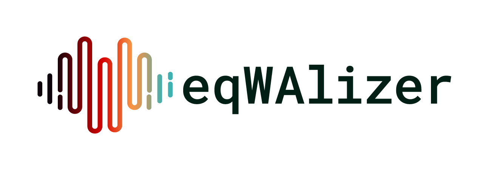

# eqWAlizer

A type-checker for Erlang.

<picture>
  <source media="(prefers-color-scheme: dark)" srcset="./logo/eqWAlizer_final_Full_Logo_White_Text.png">
  
</picture>

## Using it with rebar3 projects

eqWAlizer is integrated and distributed with ELP (Erlang Language Platform).

1. Use OTP 26 or higher.
2. [Install ELP](https://whatsapp.github.io/erlang-language-platform/docs/get-started/install/).
3. [Add](https://whatsapp.github.io/erlang-language-platform/docs/get-started/configure-project/rebar3/) `eqwalizer_support` dependency
   to your rebar3 project definition (see below)
4. From the project directory run:
  - `elp eqwalize <module>` to type-check a single module
  - `elp eqwalize-all` to type-check all `src` modules in the project


Adding `eqwalizer_support`:

```
{deps, [
  {eqwalizer_support,
    {git_subdir,
        "https://github.com/whatsapp/eqwalizer.git",
        {branch, "main"},
        "eqwalizer_support"}}
]}.
```

## Using it with non-rebar projects

1. Use OTP 26 or higher.
2. [Install ELP](https://whatsapp.github.io/erlang-language-platform/docs/get-started/install/).
3. [Write a `project.json`](https://whatsapp.github.io/erlang-language-platform/docs/get-started/configure-project/custom-project/) file describing your project.
4. From the project directory, assuming your `.json` file is called `project.json` run:
  - `elp eqwalize <module> --project project.json` to type-check a single module
  - `elp eqwalize-all --project project.json` to type-check all `src` modules in the project

## FAQ

Please refer to [the FAQ document](./FAQ.md) for answers to some common questions,
including:

- What's the difference between eqWAlizer and Dialyzer?
- Why not extend Dialyzer, rather than creating a new tool?
- What about Elixir?

## Where can I learn more about eqWAlizer, its technical principles, its relation to dialyzer and elixir support feasibility?

[here](https://www.beamrad.io/35).

## License

eqWAlizer is [Apache licensed](./LICENSE).
